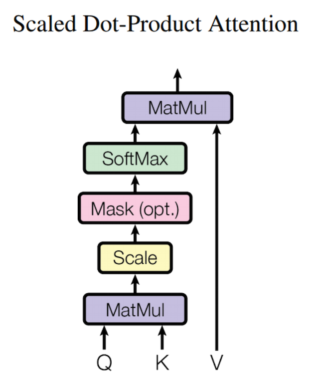
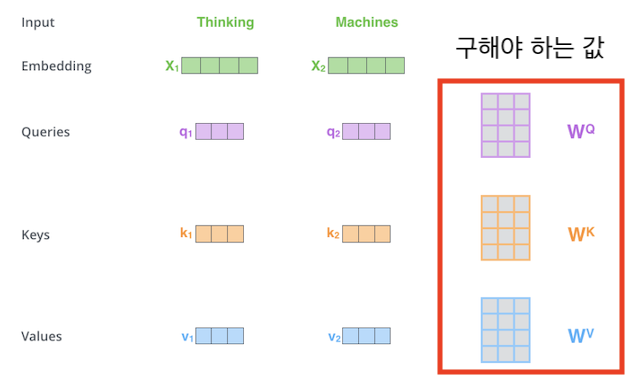

### Head가 8개면 앞 뒤 8개 단어를 찾는다는건가? Head를 쓰는 이유는 뭐지?

### Transformer가 학습하는 원리는 뭐지?

트랜스포머의 학습(train)은 인코더와 디코더 입력이 주어졌을 때 정답에 해당하는 단어의 확률 값을 높이는 방식으로 수행됩니다. 이를 나타낸 다음 그림을 보면 모델은 이번 시점의 정답인 I에 해당하는 확률은 높이고 나머지 단어의 확률은 낮아지도록, 모델 전체를 갱신합니다.

출처 : <a href = 'https://ratsgo.github.io/nlpbook/docs/language_model/transformers/'> Transformer 살펴보기 </a>

### Scaled dot product attention은 무엇을 계산하려는 용도이지?

    해당 식으로 W를 찾는건가?

### Score은 뭐지..? (임시저장용)

- query와 key의 곱을 한뒤 attention 차원의 루트 값으로 나눈다.

  $score(p,k) = \frac{Q K^\text{T}}{\sqrt{d}}$

    

- score을 통해 query, key, value의 W을 찾는다.

  - forward Propagation 예시 : $embedding(1*4) * W^Q (4*3) = q_1(1*3)$

      

### Attention이 이해가 안된다.

**Attention 의미**
우선 어텐션(attention)은 시퀀스 입력에 수행하는 기계학습 방법의 일종인데요. 어텐션은 시퀀스 요소들 가운데 태스크 수행에 중요한 요소에 집중하고 그렇지 않은 요소는 무시해 태스크 수행 성능을 끌어 올립니다. 어텐션은 기계 번역 과제에 처음 도입됐습니다.

기계 번역에 어텐션을 도입한다면 타깃 언어를 디코딩할 때 소스 언어의 단어 시퀀스 가운데 디코딩에 도움되는 단어들 위주로 취사 선택해서 번역 품질을 끌어 올리게 됩니다. 즉, 어텐션은 디코딩할 때 소스 시퀀스 가운데 중요한 요소들만 추립니다.

셀프 어텐션이란, 말 그대로 자기 자신에 수행하는 어텐션 기법입니다. 입력 시퀀스 가운데 태스크 수행에 의미 있는 요소들 위주로 정보를 추출한다는 것이죠.

**Attention 탄생 배경 **
RNN은 시퀀스 길이가 길어질 수록 정보 압축에 문제가 발생합니다. 오래 전에 입력된 단어는 잊어버리거나, 특정 단어 정보를 과도하게 반영해 전체 정보를 왜곡하는 경우가 자주 생긴다는 것이죠. 어텐션은 이러한 문제점을 해결하기 위해 제안됐습니다. 디코더 쪽 RNN에 어텐션을 추가하는 방식입니다. 어텐션은 디코더가 타깃 시퀀스를 생성할 때 소스 시퀀스 전체에서 어떤 요소에 주목해야 할지 알려주므로 카페가 소스 시퀀스 초반에 등장하거나 소스 시퀀스의 길이가 길어지더라도 번역 품질이 떨어지는 것을 막을 수 있습니다. 참고로 그림14의 예시에서는 어텐션 기법으로 주목되는 단어에 좀 더 짙고 굵은 실선을 그려 놓았습니다.

### LayerNorm 장점 및 적용하는 이유는?

### maxlength는 무슨 용도의 parameter일까?
