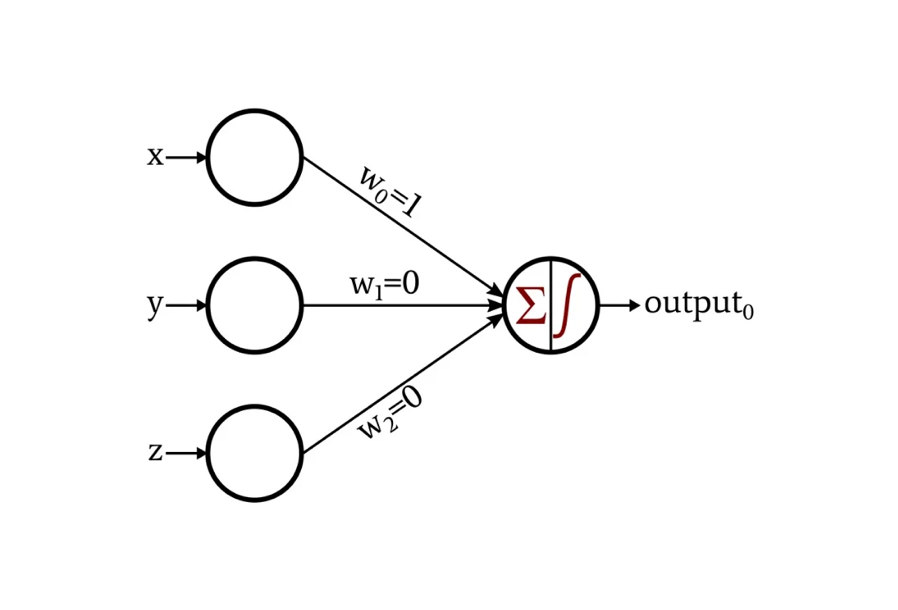
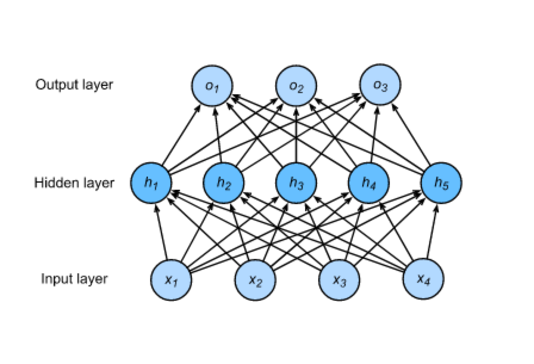
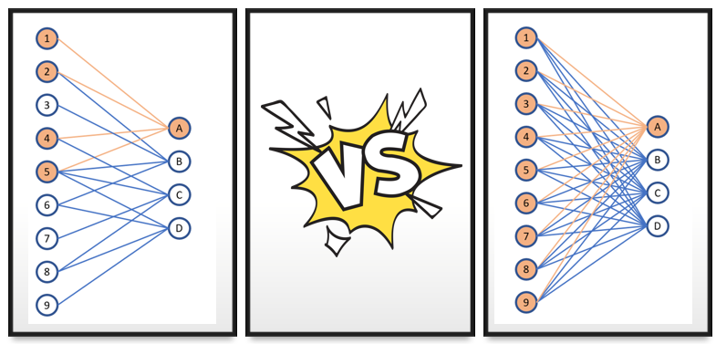
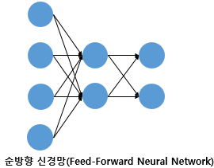
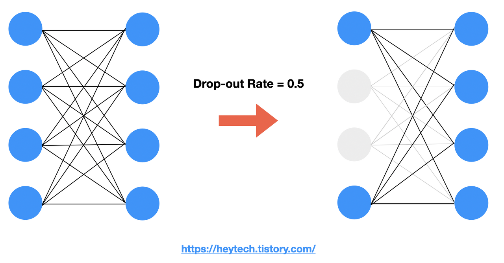
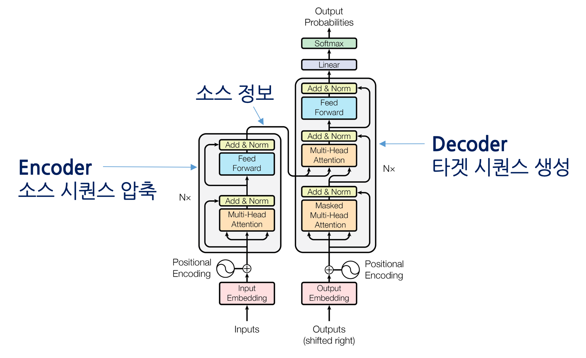

### nn.Linear

a simple fully connected neural network

- logit을 만들어준다.(logit = 확률을 정수로 표현하는 방법)
- 차원을 늘리거나 줄이거나 하는 용도로 사용한다.

### activation function

> 신경망에서는 노드에 들어오는 값들에 대해 곧바로 다음 레이어로 전달하지 않고 활성화 함수를 통과시킨 후 전달한다. 활성화 함수(activation function)는 입력 신호의 총합을 출력 신호로 변환하는 함수로, 입력 받은 신호를 얼마나 출력할지 결정하고 네트워크에 층을 쌓아 비선형성을 표현할 수 있도록 해준다.
>
> 출처 : <a href='https://heeya-stupidbutstudying.tistory.com/entry/ML-%ED%99%9C%EC%84%B1%ED%99%94-%ED%95%A8%EC%88%98Activation-Function'>[ML] 활성화 함수(Activation Function) 종류 정리</a>

An Activation Function decides _whether a neuron should be activated or not_. This means that it will decide whether `the neuron’s input to the network is important or not in the process of prediction` using simpler mathematical operations.

### Fully connected layer = Dense Layer

- unit : layer 안에 있는 동그라미를 부르는 용어

- input layer : layer에 있는 하나의 값들은 column 이라고 이해하면 직관적이다. 또는 Token 최대 개수로 봐도 된다.
- hidden layers : input, output layer를 제외한 모든 layer를 의미
  이전 layer와 다음 layer가 완전히 연결 된 상태를 fully connected layer라고 한다.
- input layer : input layer와 마찬가지로 layer에 있는 하나의 값들은 column 이라고 이해하면 직관적이다. 꼭 input layer와 같은 size일 필요는 없다.
- fully connected layer : 아래 그림을 보면 개별 뉴런끼리 모두 연결 되어 있음을 볼 수 있다. 이와 같은 구조를 fully connected layer라 한다.
- perceptron : 여러개 값을 하나의 뉴런에 넣은 다음 하나의 output을 만드는 방법.
  

- Multi Layered Perceptron(MLP) :
  fully connected 된 구조

  

- Q.Fully connected Layer라고 하면 Perceptron이라고 봐도 되나.

  A. No. Fully connected Layer는 perceptron을 쓴다. perceptron이 무조건 fully connected Layer는 아니다.

  아래 그림처럼 cnn은 fully connected와 다르지만 output값을 하나만 낸다는 면에서 perceptron을 쓰고 있다.
  

- Q. Multi Layer를 쓰는 이유는 ?
  A. 단층 Layer로는 XOR을 구현할 수 없기 때문, XOR 하나만 있으면 모든 대상을 구분할 수 있음.

### Feed_Fowrad_Neural_Netwrok(FFNN)

한 방향으로만 데이터가 흐르는 네트워크를 의미한다.


<a href='https://wikidocs.net/24987'> 이미지 출처 </a>

<참고자료>

<a href='https://ko.d2l.ai/chapter_deep-learning-basics/mlp.html'> Dive into Deep Learning </a>

이와 반대되는게 RNN이다.

### Dropout

- 랜덤으로 Unit을 제거하는 방법 | Unit(=feature=column) Layer 내 동그라미를 의미
- overfitting을 방지하고 여러 Unit을 골고루 학습 시키기 위한 목적
- ensemble이라는 개념을 사용해서 하나의 layer를 여러번 학습 시킨 다음 이를 평균으로 적용해 최종 weight을 구한다.
- dropout_rate : 개별 unit이 사라질지 나타날지의 확률임. 전체 unit 개수를 의미하는게 아님.
  
  <a href='https://heytech.tistory.com/127'> 이미지 출처 </a>

### Layer Norm과 Batch Norm

Deep Learning에서 쓰이는 Normalization 임.

### Einstein Summation Convention(einsum)

```python
import numpy as np

a = np.arange(25).reshape(5,5)
a
```

```python

array([[ 0,  1,  2,  3,  4],
       [ 5,  6,  7,  8,  9],
       [10, 11, 12, 13, 14],
       [15, 16, 17, 18, 19],
       [20, 21, 22, 23, 24]])
```

```python
# 합을 구하는 notiation 방법
np.einsum('ij->', a)
300
np.einsum('ij->i', a) # 행 단위로 값을 계산하라는 의미
array([ 10,  35,  60,  85, 110])

# 곲을 구하는 notation 방법
a = np.array([[1,2],[3,4]])
b = np.array([[2,3],[4,5]])

np.einsum('ij,jk->ik',a,b)  2*2 dot
# np.einsum('ij,jk',a,b)와 동일

```

출처 : <a href = 'https://zmade.tistory.com/48'>Einsum (Einstein Summation) </a>

### nn.Linear은 왜쓰는거지?

Deep Learning은 Linear와 Activation function의 교환으로 구성된다. Linear function에서는 W와 b를 먹여 값을 계산하고 Activation에서는 이러한 값을 모아 output을 출력한다.

### Transformer는 SeqtoSeq 모델 중 하나이다.

- Seq to Seq 를 RNN이 아닌 Attention만으로 구현한 모델이다.

시퀀스-투-시퀀스
트랜스포머(Transformer)란 기계 번역(machine translation) 등 시퀀스-투-시퀀스(sequence-to-sequence) 과제를 수행하기 위한 모델입니다. 여기에서 시퀀스란 단어(word) 같은 무언가(something)의 나열을 의미하는데요. 시퀀스-투-시퀀스는 특정 속성을 지닌 시퀀스를 다른 속성의 시퀀스로 변환하는 작업을 가리킵니다.

기계 번역을 예시로 시퀀스-투-시퀀스가 어떤 태스크인지 알아봅시다. 기계 번역이란 어떤 언어(소스 언어, source language)의 단어 시퀀스를 다른 언어(대상 언어, target language)의 단어 시퀀스로 변환하는 과제입니다. 예를 들면 다음과 같습니다.

그림1 기계 번역에서의 ‘시퀀스-투-시퀀스’

`어제, 카페, 갔었어, 거기, 사람, 많더라 > I, went, to, the, cafe, There, were, many, people, there`

자세히 살펴보면 소스 시퀀스의 길이(단어 6개)와 타깃 시퀀스의 길이(10개)가 다르다는 점을 알 수 있습니다. 이처럼 시퀀스-투-시퀀스 태스크는 소스와 타깃의 길이가 달라도 해당 과제를 수행하는 데 문제가 없어야 합니다.

인코더는 소스 시퀀스의 정보를 압축해 디코더로 보내주는 역할을 담당합니다. 인코더가 소스 시퀀스 정보를 압축하는 과정을 인코딩(encoding)이라고 합니다. 그리고 디코더는 인코더가 보내준 소스 시퀀스 정보를 받아서 타깃 시퀀스를 생성합니다. 디코더가 타겟 시퀀스를 생성하는 과정을 디코딩(decoding)이라고 합니다. 예를 들어 기계번역에서는 인코더가 한국어 문장을 압축해 디코더에 보내고, 디코더는 이를 받아 영어로 번역합니다.



출처 : <a href = 'https://ratsgo.github.io/nlpbook/docs/language_model/transformers/'> Transformer 살펴보기 </a>
